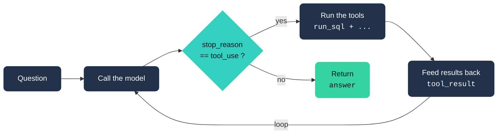

# Agent Loop

This diagram shows the control flow inside the SQL agent.

## The Flow



## Step By Step

### 1. Question

The loop starts with the user's question.

In code, `run_agent()` stores this as the first message:

```python
messages = [{"role": "user", "content": question}]
```

That message history is passed to the model on every turn.

### 2. Call The Model

The agent calls Claude with:

- the system prompt
- the current message history
- the available tool definitions

In this project, the tools are:

- `get_schema`
- `profile_table`
- `run_sql`

The model can either answer directly or request one or more tool calls.

### 3. Check `stop_reason`

After the model responds, the agent checks:

```python
response.stop_reason
```

If the stop reason is `tool_use`, the model is saying:

> I need a tool result before I can continue.

If the stop reason is not `tool_use`, the model is done and the agent returns
the assistant's text as the final answer.

### 4. Run The Tools

When the model requests tools, the response contains `tool_use` blocks. Each
block includes:

- the tool name
- the tool input
- a tool-use ID

For example, the model might request:

```text
run_sql({"query": "SELECT COUNT(*) FROM orders"})
```

The agent looks up the matching Python function in `TOOL_MAP`, runs it, and
captures the output.

### 5. Feed Results Back

Tool outputs are not returned directly to the user. They are sent back to the
model as `tool_result` messages.

This lets the model inspect the tool output, reason over it, and decide what to
do next.

The important detail is that the model sees the result in context:

```text
User question
Assistant requested a SQL query
Tool returned rows
Assistant continues reasoning
```

### 6. Loop

After the tool results are added to the message history, the agent calls the
model again.

The model can then:

- request another tool
- fix a failed SQL query
- inspect another table
- return the final answer

The loop continues until the model stops asking for tools or the agent reaches
the `max_steps` limit.

## Why This Pattern Matters

The model itself does not have direct access to the database. It only knows what
is in the prompt and message history.

Tools are how the model interacts with the outside world:

- `get_schema` tells it what tables and columns exist
- `profile_table` gives it examples and table-level details
- `run_sql` lets it retrieve actual data

The agent loop is the glue between the model and those tools. The model decides
what it needs, the Python code executes that request, and the result is fed back
into the conversation.

## How It Maps To `src/agent.py`

| Diagram Box | Code |
|-------------|------|
| Question | `messages = [{"role": "user", "content": question}]` |
| Call the model | `_create_message(messages)` |
| `stop_reason == tool_use?` | `if response.stop_reason != "tool_use"` |
| Run the tools | `fn = TOOL_MAP.get(block.name)` then `fn(**block.input)` |
| Feed results back | `messages.append({"role": "user", "content": tool_results})` |
| Return answer | `AgentResult(final_answer=...)` |

## A Tiny Example

User asks:

```text
How many orders are there?
```

The loop might look like this:

```text
Turn 1:
  Model requests get_schema

Tool result:
  The database has customers, products, and orders.

Turn 2:
  Model requests run_sql with SELECT COUNT(*) FROM orders

Tool result:
  500

Turn 3:
  Model returns the final answer:
  There are 500 orders.
```

That is the whole loop: ask, call model, run tools if needed, feed results back,
repeat until the model can answer.
